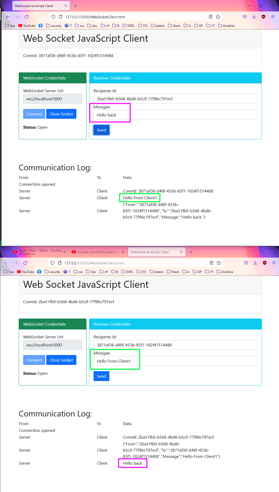

# WebSocketChat

## Table of Contents
* [General Info](#general-information)
* [Technologies Used](#technologies-used)
* [Features](#features)
* [Screenshots](#screenshots)
* [Project Status](#project-status)
* [Contact](#contact)

## General Information
Communication between two (or more) Clients using WebSocket 

## Technologies Used
- ASP .NET Core
- C#
- Bootstrap 5
- WebSocket
- Vanilla JavaScript
- HTML
- CSS

## Features
- Connect to server
- Write message to another clients

## Screenshots

## Project Status
Project is: _complete_ 

## Contact
Created by [@ITKwiatek](https://github.com/ITKwiatek/) - feel free to contact me!
